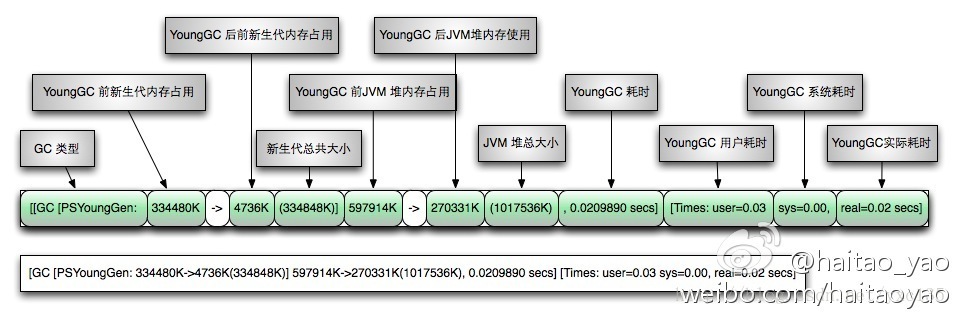

# JVM学习系列(一)

## 1. JVM参数解释

- -Xms64m 设置heap 最小为64m

- -Xmx64m 设置heap 最大为64m

- -XX:+PrintGC 开启打印GC

- -XX:+PrintGCDetails 打印GC详细信息

- -XX:+PrintGCTimeStamps 打印发生GC时间

- -XX:NewRatio=2 设置old与young的比例为2：1

- -XX:SurvivorRatio=8 设置survivor 与 eden的比例为1：1：8
## 2. JVM图解

   [参考链接](https://blog.csdn.net/yxc135/article/details/12137663)

## 3. JVM垃圾收集器

​     3.1 垃圾回收算法

​     3.2 CMS垃圾回收器

​     3.3 G1垃圾回收器

[垃圾清理](https://blog.csdn.net/a724888/article/details/78764006)

https://blog.csdn.net/jisuanjiguoba/article/details/80156781