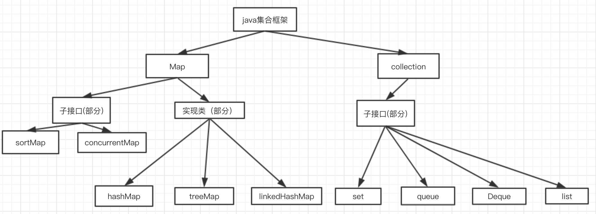
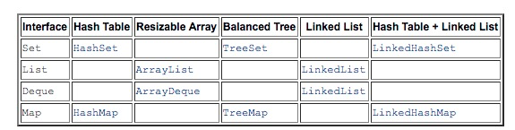

# 1、总体框架设计图






# 2、具体实现类分析

### 2.1、ArrayList

#### 2.1.1、属性

```java
// 默认初始化大小
private static final int DEFAULT_CAPACITY = 10;

// 初始化时，指定大小为0时，使用该变量
private static final Object[] EMPTY_ELEMENTDATA = {};

// 初始化时，没有指定大小时，使用该变量
private static final Object[] DEFAULTCAPACITY_EMPTY_ELEMENTDATA = {};

//真正存储数据的地方
transient Object[] elementData; // non-private to simplify nested class access

//记录当前存储了多少数据
private int size;

//记录对当前List操作的次数，在Iterator迭代时，删除数据，会抛出异常就是根据该值进行判断的,
//该值是在AbstractList中定义的
private int modCount
```

#### 2.1.2、new ArrayList的三种方式

```java
//指定默认大小
public ArrayList(int initialCapacity) {
    if (initialCapacity > 0) {
        this.elementData = new Object[initialCapacity];
    } else if (initialCapacity == 0) {
        this.elementData = EMPTY_ELEMENTDATA;
    } else {
        throw new IllegalArgumentException("Illegal Capacity: "+
                                           initialCapacity);
    }
}

//不指定大小
public ArrayList() {
    this.elementData = DEFAULTCAPACITY_EMPTY_ELEMENTDATA;
}

//使用collection子类初始化使用Arrays.copyOf(其实底层是System.arraycopy)
public ArrayList(Collection<? extends E> c) {
    elementData = c.toArray();
    if ((size = elementData.length) != 0) {
        // c.toArray might (incorrectly) not return Object[] (see 6260652)
        if (elementData.getClass() != Object[].class)
            elementData = Arrays.copyOf(elementData, size, Object[].class);
    } else {
        // replace with empty array.
        this.elementData = EMPTY_ELEMENTDATA;
    }
}
```

#### 2.1.3、add方法

```java
public boolean add(E e) {
    ensureCapacityInternal(size + 1);  
    elementData[size++] = e;
    return true;
}

/**
     * 该方法做了两件事
     * 1.检查当前elementData大小是否需要扩容
     * 2.扩容
     */
private void ensureCapacityInternal(int minCapacity) {
    ensureExplicitCapacity(calculateCapacity(elementData, minCapacity));
}

/**
 * 计算最小容量大小，可以看到，如果使用的是new ArrayList()这个构造函数，那么这里会返回最小默认容量
 * 10，这里minCapacity的值为size+1
 */
private static int calculateCapacity(Object[] elementData, int minCapacity) {
    if (elementData == DEFAULTCAPACITY_EMPTY_ELEMENTDATA) {
        return Math.max(DEFAULT_CAPACITY, minCapacity);
    }
    return minCapacity;
}

//操作次数+1，判断是否需要扩容
private void ensureExplicitCapacity(int minCapacity) {
    modCount++; //操作次数+1

    // overflow-conscious code
    if (minCapacity - elementData.length > 0)
        grow(minCapacity); //当前容量小于前面函数calculateCapacity返回的最小容量是，扩容处理
}

//扩容处理
private void grow(int minCapacity) {
        // overflow-conscious code
        int oldCapacity = elementData.length; //获取原来的容量大小
        int newCapacity = oldCapacity + (oldCapacity >> 1); //新容量大小大概为老的1.5倍,这里使用的是位运算。相对十进制运行比较快
        if (newCapacity - minCapacity < 0)
            newCapacity = minCapacity;
        if (newCapacity - MAX_ARRAY_SIZE > 0)
            newCapacity = hugeCapacity(minCapacity);
        // minCapacity is usually close to size, so this is a win:
        elementData = Arrays.copyOf(elementData, newCapacity);// 会将所有的数据复制一份到新数组，所以ArrayList每次扩容都会比较慢，特别是数据大的情况下
    }
```

### 2.2、LinkedList

#### 2.2.1、属性

```java
transient int size = 0; //记录当前数据量

transient Node<E> first;//头指针

transient Node<E> last;//尾指针

/**私有的静态内部类，存储数据
  * 可以看到LinkedList是双向指针
  */
private static class Node<E> {
        E item;
        Node<E> next;
        Node<E> prev;

        Node(Node<E> prev, E element, Node<E> next) {
            this.item = element;
            this.next = next;
            this.prev = prev;
        }
    }
```

#### 2.2.2、add方法

```java
public boolean add(E e) {
    linkLast(e);
    return true;
}

//尾插法
void linkLast(E e) {
        final Node<E> l = last;
        final Node<E> newNode = new Node<>(l, e, null);
        last = newNode;
        if (l == null)
            first = newNode;
        else
            l.next = newNode;
        size++;
        modCount++;
    }
```

### 2.3、HashMap

#### 2.3.0 hash方法及冲突解决

常见的Hash函数有以下几个：

> 直接定址法：直接以关键字k或者k加上某个常数（k+c）作为哈希地址。
>
> 数字分析法：提取关键字中取值比较均匀的数字作为哈希地址。
>
> 除留余数法：用关键字k除以某个不大于哈希表长度m的数p，将所得余数作为哈希表地址。
>
> 分段叠加法：按照哈希表地址位数将关键字分成位数相等的几部分，其中最后一部分可以比较短。然后将这几部分相加，舍弃最高进位后的结果就是该关键字的哈希地址。
>
> 平方取中法：如果关键字各个部分分布都不均匀的话，可以先求出它的平方值，然后按照需求取中间的几位作为哈希地址。
>
> 伪随机数法：采用一个伪随机数当作哈希函数。

上面介绍过碰撞。衡量一个哈希函数的好坏的重要指标就是发生碰撞的概率以及发生碰撞的解决方案。任何哈希函数基本都无法彻底避免碰撞，常见的解决碰撞的方法有以下几种：

- 开放定址法：
  - 开放定址法就是一旦发生了冲突，就去寻找下一个空的散列地址，只要散列表足够大，空的散列地址总能找到，并将记录存入。
- 链地址法
  - 将哈希表的每个单元作为链表的头结点，所有哈希地址为i的元素构成一个同义词链表。即发生冲突时就把该关键字链在以该单元为头结点的链表的尾部。
- 再哈希法
  - 当哈希地址发生冲突用其他的函数计算另一个哈希函数地址，直到冲突不再产生为止。
- 建立公共溢出区
  - 将哈希表分为基本表和溢出表两部分，发生冲突的元素都放入溢出表中。

#### 2.3.1、属性

```java
//默认初始容量
static final int DEFAULT_INITIAL_CAPACITY = 1 << 4; // aka 16

//最大容量，指的是数组大小
static final int MAXIMUM_CAPACITY = 1 << 30;

//默认的负载因子，据说是根据泊松分布算出来的(不负责该说法的准确性，手动狗头)
static final float DEFAULT_LOAD_FACTOR = 0.75f;

//链表的大小超过该值就会变为红黑树
static final int TREEIFY_THRESHOLD = 8;

//红黑的大小小于该值就会变为链表
static final int UNTREEIFY_THRESHOLD = 6;

//暂时不清楚该值的作用
static final int MIN_TREEIFY_CAPACITY = 64;

//实际存储数据
transient Node<K,V>[] table;

transient Set<Map.Entry<K,V>> entrySet;

//map的实际大小
transient int size;

// map被操作的次数
transient int modCount;

//The next size value at which to resize (capacity * load factor).
int threshold;

//用户指定的负载因子
final float loadFactor;
```

#### 2.3.2、put方法

```java
/**
  *实际是调私有方法putVal
  */
public V put(K key, V value) {
    return putVal(hash(key), key, value, false, true);
}

/**
  *计算key的hash值
  *
  *一篇很详细的文章介绍map的hash计算为什么这么设计：https://www.zhihu.com/question/20733617
  *核心目的：为了提高 存储key-value的数组下标位置 的随机性 & 分布均匀性，尽量避免出现hash值冲突。
  * 即：对于不同key，存储的数组下标位置要尽可能不一样
  */
static final int hash(Object key) {
        int h;
        return (key == null) ? 0 : (h = key.hashCode()) ^ (h >>> 16);
    }

/**
  * 该函数主要做几件事：
  * 1.数组不存在时或者大小为0时，扩容
  * 2.尾插法插入数据
  * 3.判断是否需要(红黑树->链表，链表->红黑树)
  */
final V putVal(int hash, K key, V value, boolean onlyIfAbsent,
                   boolean evict) {
        Node<K,V>[] tab; Node<K,V> p; int n, i;
        if ((tab = table) == null || (n = tab.length) == 0)
            n = (tab = resize()).length; //数组不存在时或者大小为0时，重新计算大小
        if ((p = tab[i = (n - 1) & hash]) == null)
            tab[i] = newNode(hash, key, value, null); //数组下标i没有值时(也就是没有冲突时)，直接放入数据
        else {
            /**
              *发生了hash冲突，分情况处理
              *
              */
            Node<K,V> e; K k;
            if (p.hash == hash &&
                ((k = p.key) == key || (key != null && key.equals(k))))
                e = p; //key是一样的，直接返回
            else if (p instanceof TreeNode)
                e = ((TreeNode<K,V>)p).putTreeVal(this, tab, hash, key, value);
            else {
                for (int binCount = 0; ; ++binCount) {
                    if ((e = p.next) == null) {
                        p.next = newNode(hash, key, value, null);
                        if (binCount >= TREEIFY_THRESHOLD - 1) // -1 for 1st
                            treeifyBin(tab, hash);
                        break;
                    }
                    if (e.hash == hash &&
                        ((k = e.key) == key || (key != null && key.equals(k))))
                        break;
                    p = e;
                }
            }
            if (e != null) { // existing mapping for key
                V oldValue = e.value;
                if (!onlyIfAbsent || oldValue == null)
                    e.value = value;
                afterNodeAccess(e);
                return oldValue;
            }
        }
        ++modCount;
        if (++size > threshold)
            resize();
        afterNodeInsertion(evict);
        return null;
    }

/**
  *该函数实现map的扩容操作
  *1.每次扩容为原来的两倍大小
  *2.重建hash表(耗时最多的部分)
  *3.
  *
  */
final Node<K,V>[] resize() {
        Node<K,V>[] oldTab = table;
        int oldCap = (oldTab == null) ? 0 : oldTab.length;
        int oldThr = threshold;
        int newCap, newThr = 0; //新的容量，新的扩容阈值
        if (oldCap > 0) {
            //最大值了，无法再扩容了
            if (oldCap >= MAXIMUM_CAPACITY) {
                threshold = Integer.MAX_VALUE;
                return oldTab;
            }
            //扩容两倍，阈值变为两倍
            else if ((newCap = oldCap << 1) < MAXIMUM_CAPACITY &&
                     oldCap >= DEFAULT_INITIAL_CAPACITY)
                newThr = oldThr << 1; // double threshold
        }
        else if (oldThr > 0) // initial capacity was placed in threshold
            newCap = oldThr;
        else {   
            //使用默认值进行初始化，newCap=16，newThr=12
            newCap = DEFAULT_INITIAL_CAPACITY;
            newThr = (int)(DEFAULT_LOAD_FACTOR * DEFAULT_INITIAL_CAPACITY);
        }
        if (newThr == 0) {
            float ft = (float)newCap * loadFactor;
            newThr = (newCap < MAXIMUM_CAPACITY && ft < (float)MAXIMUM_CAPACITY ?
                      (int)ft : Integer.MAX_VALUE);
        }
        threshold = newThr;
        
       /**
         *重头戏：重建hash表
         * 
         */
        @SuppressWarnings({"rawtypes","unchecked"})
            Node<K,V>[] newTab = (Node<K,V>[])new Node[newCap];
        table = newTab;
        if (oldTab != null) {
            for (int j = 0; j < oldCap; ++j) {
                Node<K,V> e;
                if ((e = oldTab[j]) != null) {
                    oldTab[j] = null;
                     //没有尾巴时，直接重新计算下标，放入新数组
                    if (e.next == null)
                        newTab[e.hash & (newCap - 1)] = e;
                    else if (e instanceof TreeNode)
                        ((TreeNode<K,V>)e).split(this, newTab, j, oldCap);
                    else { // preserve order
                        Node<K,V> loHead = null, loTail = null;
                        Node<K,V> hiHead = null, hiTail = null;
                        Node<K,V> next;
                        do {
                            next = e.next;
                            
                            /**`
                              *解释下这里分两个if计算的原因：
                              *这里有两个前提：
                              *1.hashMap计算数组下标的公式：key.hash & (table.length-1)
                              *2.table.lenght的值一定是偶数
                              *
                              *这里我们假设oldCap = 16.则(table.lenght-1)=15
                              *那么newCap就=32，则(table.lenght-1)=31
                              *
                              *计算数组下标就像下面这样:
                              *x,????(数据的hash值)
                              *0,1111(15)
                              *1,1111(31)
                              *可以看出来，重hash时，完全取决于数据的hash多出来的一位(也就是x)是0还是
                              *1。是0则在新数组的下标就不变，是1则在新数组的下标为oldCap+原下标
                              */
                            //还是原来的下标
                            if ((e.hash & oldCap) == 0) {
                                if (loTail == null)
                                    loHead = e;
                                else
                                    loTail.next = e;
                                loTail = e;
                            }
                            //原来的下标+oldCap
                            else {
                                if (hiTail == null)
                                    hiHead = e;
                                else
                                    hiTail.next = e;
                                hiTail = e;
                            }
                        } while ((e = next) != null);
                        if (loTail != null) {
                            loTail.next = null;
                            newTab[j] = loHead;
                        }
                        if (hiTail != null) {
                            hiTail.next = null;
                            newTab[j + oldCap] = hiHead;
                        }
                    }
                }
            }
        }
        return newTab;
    }
```

#### 2.3.3、get方法


