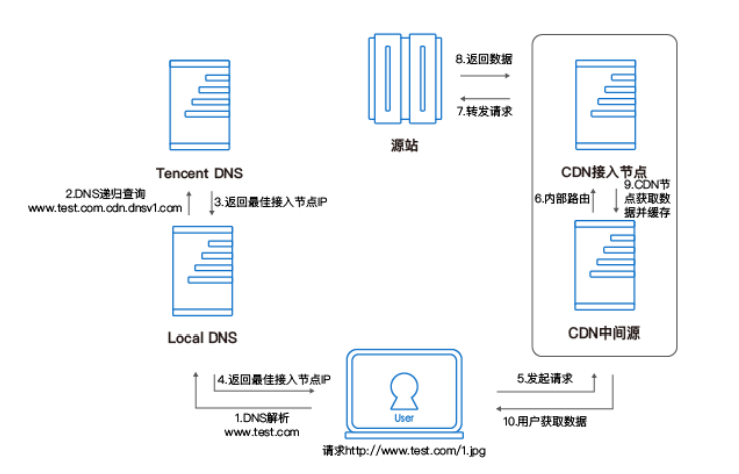

##一、什么是CDN

​       CDN系统能够实时地根据网络流量和各节点的连接、负载状况以及到用户的距离和响应时间等综合信息将用户的请求重新导向离用户最近的服务节点上。

​       也就是cdn对源站的数据做了备份（比如淘宝的图片，微博的热搜），这样用户访问时不需要到淘宝或者微博的主站去访问数据，可以直接访问离你最近的服务器。比如微博机房在北京，你在三亚，这个时候访问微博，cdn就可能将你引导三亚的机房，加快访问速度。

##二、CDN可以做什么

​	1、加快访问速度

​	2、减少源站的访问压力

##三、CDN原理

3.1、cdn原理依赖于下面两个技术：

- ​	DNS

- ​	cname

3.2、先看下未使用cdn加速的网络访问流程：

1. 在浏览器键入网址
2. 浏览器请求dns服务器，查询到网址对应的IP（从根域名向下访问）
3. 浏览器向服务器发起TCP连接
4. 浏览器通过建立的TCP连接发送HTTP协议报文
5. 服务器向浏览器发送页面内容
6. 浏览器将页面展现出来

3.3、使用了cdn加速的网络访问流程：

- cname:

​        在cdn中实现原理是：给源站域名添加CNMAE,别名为加速节点的域名。当用户向源站发起请求时，dns服务器解析源站域名时会发现有CNMAE记录，这时dns服务器会向CNAME域名发起请求，请求会被调度至加速节点的域名。

- #### 腾讯云cdn实例

​        假设您的业务源站域名为 [www.test.com](http://www.test.com) ，当域名接入 CDN 开始使用加速服务后，您
 的用户发起 HTTP 请求，实际的处理流程如图所示：

- 用户向 [www.test.com](http://www.test.com) 下的某图片资源，如 1.jpg 发起请求，先要向 Local DNS 发
   起域名解析请求；
- 当 Local DNS 解析 [www.test.com](http://www.test.com) 时，会发现已经配置了 CNAME
   [www.test.com.cdn.dnsv1.com](http://www.test.com.cdn.dnsv1.com)，解析请求会发送至 Tencent DNS（GSLB），GSLB 为腾
   讯云自主研发的调度体系，会为请求分配最佳节点 IP；
- Local DNS 获取 Tencent DNS 返回的解析 IP；
- 用户侧获取解析 IP；
- 用户向获取的 IP 发起对资源 1.jpg 的访问请求；
- 若该 IP 对应的节点缓存有 1.jpg，则会将数据直接返回给用户（10），此时请求结
   束。若该节点未缓存 1.jpg，则节点会向业务源站发起对 1.jpg 的请求（6、7、8），
   获取资源后，结合用户自定义配置的缓存策略（可参考用户指南中缓存时间设置章
   节内容），将资源存储（9），并返回给用户（10），此时请求结束。

##四、参考资料

1、https://www.jianshu.com/p/14dede92b02f

2、https://colobu.com/2016/09/23/CDN-introduction/

3、https://yq.aliyun.com/articles/104041