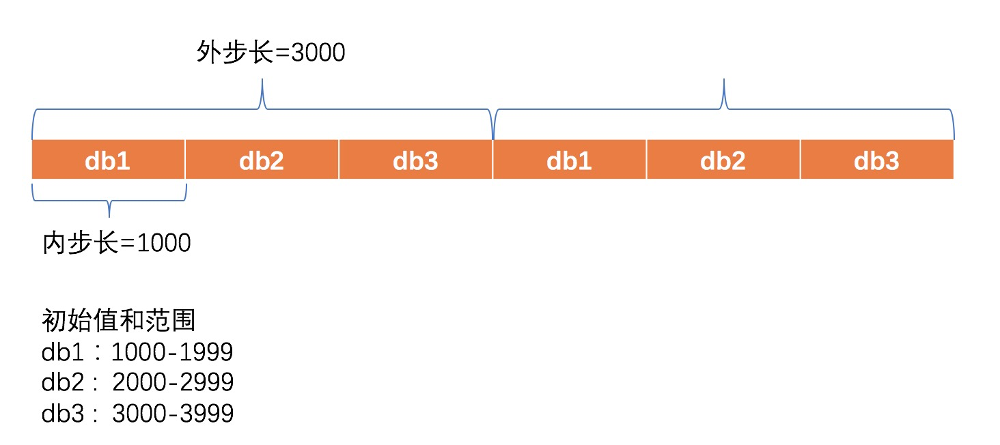

## 一、为什么需要分布式ID

在分布式系统中，需要对消息、订单等数据唯一标识，显然单纯的数据库自增id是无法满足分布式下的唯一性的，所以需要一个全局唯一的id。

## 二、分布式ID需要解决什么问题

- 保证全局唯一，并且有递增趋势：由于MySQL使用B+Tree作为索引存储，所以需要保证id的递增，保证磁盘的写入性能（顺序写）
- 由于id一般会建立索引，所以长度不能过长。
- 高性能，高可用：业务性能不受限于获取id的接口性能；部分机器宕机后依然可用
- 易于线性扩展

## 三、分布式ID生成方案

### 3.1 UUID

UUID(Universally Unique Identifier)的标准型式包含32个16进制数字，以连字号分为五段，形式为8-4-4-4-12的36个字符，示例：`550e8400-e29b-41d4-a716-446655440000`，到目前为止业界一共有5种方式生成UUID。详情见IETF发布的UUID规范： [A Universally Unique IDentifier (UUID) URN Namespace](http://www.ietf.org/rfc/rfc4122.txt)

优点：

- 本地生成、没有网络消耗

缺点：

- 不易于存储：UUID太长，16字节128位，通常以36长度的字符串表示，很多场景不适用。

- 信息不安全：基于MAC地址生成UUID的算法可能会造成MAC地址泄露，这个漏洞曾被用于寻找梅丽莎病毒的制作者位置。

- ID作为主键时在特定的环境会存在一些问题，比如做DB主键的场景下，UUID就非常不适用：

  ① MySQL官方有明确的建议主键要尽量越短越好，36个字符长度的UUID不符合要求。

  > All indexes other than the clustered index are known as secondary indexes. In InnoDB, each record in a secondary index contains the primary key columns for the row, as well as the columns specified for the secondary index. InnoDB uses this primary key value to search for the row in the clustered index.**If the primary key is long, the secondary indexes use more space, so it is advantageous to have a short primary key**.

② 对MySQL索引不利：如果作为数据库主键，在InnoDB引擎下，UUID的无序性会影响数据的插入性能。

### 3.2 snowflake

待研究

### 3.3 数据库批量发号

创建发号Sequence表，主键列为**AUTO_INCREMENT**；指定一个**UNIQUE KEY**列 name。

```mysql
create table `sequence`(
 `id` bigint(20) not null auto_increment,
 `name` varchar(64) not null comment '应用名',
 `max_id` bigint(20) unsigned not null comment '已经分配的最大id',
 primary key (`id`),
 unique key `uk_name` (`name`)
)engine=innodb default charset=utf8;
```

获取ID：采用REPLACE INTO更新插入记录，触发AUTO_INCREMENT值的更新；再SELECT LAST_INSERT_ID()来获取刚才生成的ID。

- 这两个操作要放在一个事务里先后执行，否则可能会因为当前Session中有其他的AUTO_INCREMENT值更新导致LAST_INSERT_ID()失效。
- 通过调整两个配置项@@auto_increment_increment、@@auto_increment_offset，可以设置自增序列的初始值和自增步长。
- MySQL基于自增锁来保证并发申请ID的一致性。
- 存在多个不同的ID申请者时，可以给每个应用者单独建立一个Sequence表，用于产生不同的、独立的ID序列。

```mysql
begin;
REPLACE INTO sequence (name) VALUES (#{name});
SELECT LAST_INSERT_ID();
commit;
```

`优点：`

- 非常简单，利用现有数据库系统的功能实现，成本小。

- ID号单调自增。

`缺点：`

- 强依赖DB，当DB异常时整个系统不可用。配置主从复制可以尽可能的增加可用性，但是数据一致性在特殊情况下难以保证。主从切换时的不一致可能会导致重复发号。
- 由于每次获取id，都要读写数据库，所以id发号性能瓶颈限制在单台MySQL的读写性能。

​         对于性能问题，可以多部署几个id发号服务，比如部署两个db发号，然后设置不同的初始值，步长=2。sequenceServer1的初始值为1（1，3，5，7，9，11…）、sequenceServer2的初始值为2（2，4，6，8，10…）。这是Flickr团队在2010年撰文介绍的一种主键生成策略（[Ticket Servers: Distributed Unique Primary Keys on the Cheap ](http://code.flickr.net/2010/02/08/ticket-servers-distributed-unique-primary-keys-on-the-cheap/)。

假设我们要部署N台机器，步长需设置为N，每台的初始值依次为0,1,2…N-1那么整个架构就变成了如下图所示：


这种架构貌似能够满足性能的需求，但有以下几个缺点：

- 系统水平扩展比较困难，比如定义好了步长和机器台数之后，如果要添加机器该怎么做？假设现在只有一台机器发号是1,2,3,4,5（步长是1），这个时候需要扩容机器一台。可以这样做：把第二台机器的初始值设置得比第一台超过很多，比如14（假设在扩容时间之内第一台不可能发到14），同时设置步长为2，那么这台机器下发的号码都是14以后的偶数。然后摘掉第一台，把ID值保留为奇数，比如7，然后修改第一台的步长为2。让它符合我们定义的号段标准，对于这个例子来说就是让第一台以后只能产生奇数。扩容方案看起来复杂吗？貌似还好，现在想象一下如果我们线上有100台机器，这个时候要扩容该怎么做？简直是噩梦。所以系统水平扩展方案复杂难以实现。
- ID没有了单调递增的特性，只能趋势递增，这个缺点对于一般业务需求不是很重要，可以容忍。
- 数据库压力还是很大，每次获取ID都得读写一次数据库，只能靠堆机器来提高性能。

**基于上述问题，方案可以做如下改进：**

- 原方案每次获取ID都得读写一次数据库，造成数据库压力大。改为利用proxy server批量获取，每次获取一个segment(step决定大小)号段的值。用完之后再去数据库获取新的号段，可以大大的减轻数据库的压力。 

- 各个业务不同的发号需求用name字段来区分，每个name的ID获取相互隔离，互不影响。如果以后有性能需求需要对数据库扩容，不需要上述描述的复杂的扩容操作，只需要对name分库分表就行。

- 大致架构如下图所示：

  

- Db分库分表情况下，怎么获取id

  以test_tag举例，假设现在有三个db（db1,db2,db3）提供test_tag的id服务，这个时候为了让db之间的数据不重复，需要定义内步长和外步长（内步长指单个db每次生成的id段长度，外步长值每次更新时db的初始值需要增加的值）

  

​       假设现在机器A随机命中了db2，那么机器A拿到的sequence区段一定满足公式[2000+3000*n, 2999+3000*n]，其中n为非负整数，表示sequence段被更新过的次数。那么，这里的n又怎么确定呢？此时，再假设db2对应的sequence表的当前值为x，那么机器A会去取起始值大于或等于x且满足公式[2000+3000*n, 2999+3000*n]的第一个sequence区段。如果x为5999，那拿到的区段就是[8000, 8999]，同时，此sequence表的值也会被更新为8999。所以，db列表的每一项代表的区段都不会冲突。

## 四、参考链接

- [Leaf——美团点评分布式ID生成系统](https://tech.meituan.com/2017/04/21/mt-leaf.html)

