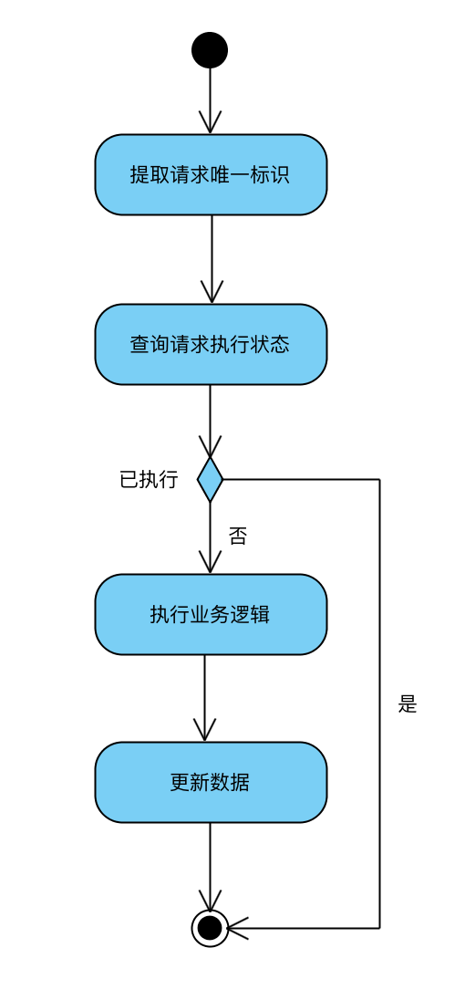
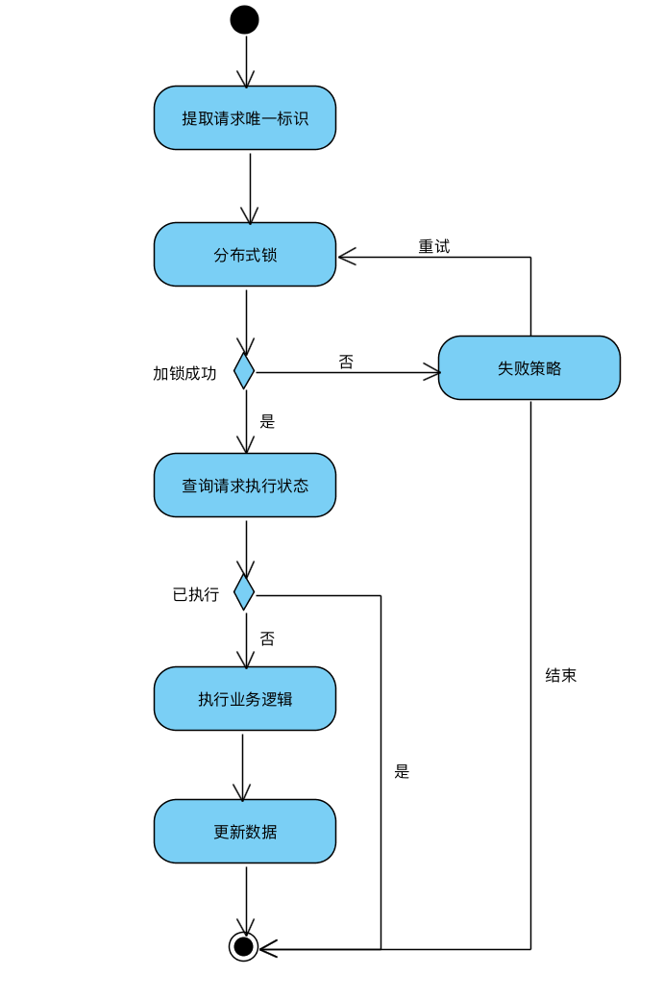

## 一、什么是幂等

幂等来源于数学概念，幂等元素被重复运算多次，依旧等于自己，即f(f(x)) = f(x);
程序世界里对于幂等，有一个很常见的描述是：对于相同的请求应该返回相同的结果，所以查询类接口是天然的幂等性接口。但是这里有个悖论，如果一个查询接口，在两次查询之间，有一个更新接口对数据进行了更新，那么两次查询的结果就不一致了，那么该查询接口还是幂等接口吗。

如果幂等的含义是相同请求返回相同结果，那实际上只需要缓存第一次的返回结果，即可在后续重复请求时实现幂等了。但真的如此？

我更赞同这种定义：**幂等指的是相同请求（identical request）执行一次或者多次所带来的副作用（side-effects）是一样的**。

> 来源：[https://developer.mozilla.org/en-US/docs/Glossary/Idempotent](https://developer.mozilla.org/en-US/docs/Glossary/Idempotent?spm=ata.13261165.0.0.107971d3qXgMYn)
> An HTTP method is idempotent if an identical request can be made once or several times in a row with the same effect while leaving the server in the same state. In other words, an idempotent method should not have any side-effects (except for keeping statistics).

## 二、为什么需要幂等

​       以订单服务、支付服务为例。用户提交数据，由订单服务生成订单，然后订单服务调用支付服务进行支付。这个时候由于网络超时等异常原因，订单服务在规定时间内没有收到响应，那么就会发起重试。这个时候如果网络恢复了，支付系统就会收到同一个订单的两次支付请求，如果支付系统没有实现幂等的话，用户将会产生两笔扣款，这将是灾难。

​       目前大型的系统都会引入消息中间件，作为大量请求的缓冲，同时也会将一些异步逻辑使用消息中间件实现。消息中间件一个很重要的功能就是有限资源内保证消息消费成功。为了保证消息消费成功，依赖于消息投递和重试，在规定时间没有收到响应，会对同一个消息进行重试。如果消费方没有实现幂等消费，轻则产生脏数据，重则产生资产损失。

​     所以实现接口的幂等是每一个程序员必须掌握的技能。

## 三、怎么实现幂等

####3.1 识别相同请求

从对上面的分析，可以知道幂等的一个重要逻辑就是***识别相同请求***。

识别同一个请求一般有几种方法：

1、如果是系统之间的调用：可以要求每次调用都必须传入***resource***、***reqNo***，这样就可以唯一标识某一次请求。

2、前后端之间的请求：可以每次进行页面前，前端先请求一个服务端，拿到一个token(服务端持久化)，每次请求都必须带上token，服务端就可以依据token唯一标识某一个请求

3、也可以直接取入参中的某几个特定参数，计算出md5值，作为唯一标识。

#### 3.2 查询执行状态

***识别相同请求***后就需要查询请求的***执行状态***，如果是已经执行了就直接返回结果，否则就执行相应的业务逻辑。

对应的V1版流程图如下：

v1版无法应对并发情况下的check，会导致有多个线程同时执行业务逻辑，导致不幂等。

v2版：

上面这个方法依赖于分布式锁的正确性，当分布式锁失效时，依旧存在幂等失败的情况。针对这个情况，可以在数据库建立去重表，利用请求的唯一标识作为uk，如果数据可以插入成功，则执行业务逻辑，否则返回失败。