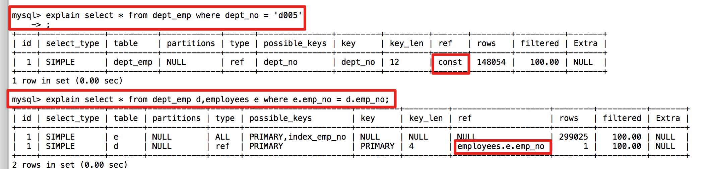

## 一、Explain输出解释

| type               |  possible_keys    |   key   | ref | row | filtered | Extra |
| ------------------ | ---- | ---- | ---- | ---- | ---- | ---- |
| 针对单表的访问方法 | 可能用到的索引 | 实际使用的索引 |      | 预计需要扫描的行数 |      |      |

### 1、type（获取数据时使用了哪种方式）

- system

  当表中只有一条记录。(引擎需要是MyISAM、Memory，innodb是`All`，那么对该表的访问方法就是`system`

- const

  该表最多有一条匹配的数据，也就是根据**唯一索引**与**常数**进行**等值匹配**时，例如：

  ```mysql
  CREATE TABLE `salaries` (
    `emp_no` int(11) NOT NULL,
    `salary` int(11) NOT NULL,
    `from_date` date NOT NULL,
    `to_date` date NOT NULL,
    PRIMARY KEY (`emp_no`,`from_date`),
  ) ENGINE=InnoDB DEFAULT CHARSET=utf8;
  
  //const
  select * from salaries where emp_no = 1 and from_date = '2020';
  //非const
  select * from salaries where emp_no = 1
  ```

- eq_ref

  在连接查询时，对于前驱表的每个数据都只有一条数据与之对应（也就是第二张表是通过唯一索引与常量等值匹配）

  ```MYSQL
  CREATE TABLE `A` (
    `id` int(11) NOT NULL,
    `name` varchar(255) NOT NULL,
    PRIMARY KEY(`id`)
  )
  
  CREATE TABLE `B` (
    `id` int(11) NOT NULL,
    `age` varchar(255) NOT NULL,
    PRIMARY KEY(`id`)
  )
  
  //对于B表使用的就会是eq_ref
  select * from A a,B b where a.id = b.id;
  ```

- ref

  当对普通索引或者使用唯一索引的部分列（需要满足最左前缀原则的基础）进行常量等值匹配时

- ref_or_null

  跟ref很像，就是查询时增加了值为NULL 的可能性(**唯一索引不会有这个效果**)

  ```mysql
  SELECT * FROM ref_table WHERE key_column=expr OR key_column IS NULL;
  ```

- range

  使用索引列获取范围值时。

  ```mysql
  SELECT * FROM tbl_name
    WHERE key_column BETWEEN 10 and 20;
  
  SELECT * FROM tbl_name
    WHERE key_column IN (10,20,30);
  ```

- index

  这个类型跟all很像，只不过是对索引树进行全部扫描。由于索引树的大小一般是远小于全表数据的，所以需要的磁盘IO次数是小于all的，所以性能好于all。

  一般是用于覆盖索引的情况下（需要的值在索引中就可以拿到，但是where又无法使用索引）

  ```mysql
  CREATE TABLE `A` (
    `id` int(11) NOT NULL,
    `name` varchar(255) NOT NULL,
    `age` int(11) NOT NULL,
     KEY `index_id_age` (`id`,`age`)
  )
  
  //
  select id from A where age = 11;
  ```

- all

  全表扫描，最差的。
  
- 性能比较

  system > const > eq_ref = ref > range > index > all

###2、possible_keys和key

​       possible_keys列中的值并不是越多越好，可能使用的索引越多，查询优化器计算查询成本时就得花费更长时间，所以如果可以的话，尽量删除那些用不到的索引。

###3、ref

当使用索引列等值匹配的条件去执行查询时，也就是在访问方法是`const`、`eq_ref`、`ref`、`ref_or_null`其中之一时，`ref`列展示的就是与索引列作等值匹配的是什么，一般来说是常数、某个列、函数。

```mysql
CREATE TABLE `dept_emp` (
  `emp_no` int(11) NOT NULL,
  `dept_no` char(4) NOT NULL,
  PRIMARY KEY (`emp_no`,`dept_no`),
  KEY `index_dept_no`(`dept_no`)
 )
 
 CREATE TABLE `employees` (
  `emp_no` int(11) NOT NULL,
  PRIMARY KEY (`emp_no`)
)
 
```



### 4、filtered

该`filtered`列指示将被表条件过滤的表行的估计百分比。最大值为100，这表示未过滤行。值从100减小表示过滤量增加。 `rows`显示检查的估计行数，`rows`× `filtered`显示将与下表连接的行数。例如，如果 `rows`为1000且 `filtered`为50.00（50％），则与下表连接的行数为1000×50％= 500。

### 5、Extra

- Using index

  使用了覆盖索引

- Using index condition

  有些搜索条件中虽然出现了索引列，但却不能使用到索引，比如下边这个查询：

  ```mysql
  SELECT * FROM s1 WHERE key1 > 'z' AND key1 LIKE '%a';
  ```

  其中的`key1 > 'z'`可以使用到索引，但是`key1 LIKE '%a'`却无法使用到索引，在以前版本的`MySQL`中，是按照下边步骤来执行这个查询的：

  - 先根据`key1 > 'z'`这个条件，从二级索引`idx_key1`中获取到对应的二级索引记录。
  - 根据上一步骤得到的二级索引记录中的主键值进行**回表**，找到完整的用户记录再检测该记录是否符合`key1 LIKE '%a'`这个条件，将符合条件的记录加入到最后的结果集。

  但是虽然`key1 LIKE '%a'`不能组成范围区间参与`range`访问方法的执行，但这个条件毕竟只涉及到了`key1`列，所以设计`MySQL`把上边的步骤改进了一下：

  - 先根据`key1 > 'z'`这个条件，定位到二级索引`idx_key1`中对应的二级索引记录。
  - 对于指定的二级索引记录，先不着急回表，而是先检测一下该记录是否满足`key1 LIKE '%a'`这个条件，如果这个条件不满足，则该二级索引记录压根儿就没必要回表。
  - 对于满足`key1 LIKE '%a'`这个条件的二级索引记录执行回表操作。

  我们说回表操作其实是一个随机`IO`，比较耗时，所以上述修改虽然只改进了一点点，但是可以省去好多回表操作的成本。`MySQL`把这个改进称之为`索引条件下推`（英文名：`Index Condition Pushdown`）。

  如果在查询语句的执行过程中将要使用`索引条件下推`这个特性，在`Extra`列中将会显示`Using index condition`

  **索引条件下推式**优化的适用性取决于以下条件：

  - ICP可用于[`InnoDB`](https://dev.mysql.com/doc/refman/8.0/en/innodb-storage-engine.html) 和[`MyISAM`](https://dev.mysql.com/doc/refman/8.0/en/myisam-storage-engine.html)表，包括分区表`InnoDB`和 `MyISAM`表。
  - 对于`InnoDB`表，ICP仅用于二级索引。ICP的目标是减少全行读取的次数，从而减少I / O操作。对于 `InnoDB`聚集索引，完整的记录已被读入`InnoDB` 缓冲区。在这种情况下使用ICP不会减少I / O。
  - 在虚拟生成的列上创建的二级索引不支持ICP。`InnoDB` 支持虚拟生成的列上的二级索引。
  - 引用子查询的条件不能下推。
  - 涉及存储功能的条件不能下推。存储引擎无法调用存储的功能。
  - 触发条件不能下推。

- use where

  where 条件中有部分字段无法用到索引

- using filesort

  - 返回的结果需要进行排序，但是无法直接使用索引进行排序。需要借助内存（快排）或者磁盘（归并排序）进行排序。

  - mysql在做排序的时候，给每个线程分配一块内存用于排序，称作sort_buffer。 如果排序的数据大小小于sort_buffer的大小，则在内存中按照排序列做快速排序即可，但如果超过sort_buffer的大小，则需要借助多份磁盘临时文件，然后通过归并算法做排序。

###6、possible_keys和key

- possible_keys 为null，key不为null

  使用了覆盖索引的情况

  ```mysql
  index_1 ('key1','key2')
  //select key1 from table where key2 = 'xxx'
  这里会使用二级索引index_1进行全索引的扫描
  ```


