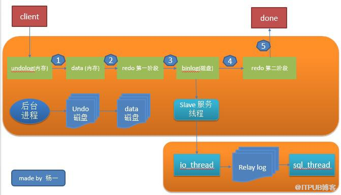

##一、数据库事务

### 1. 什么是事务

### 2. 怎么使用事务

### 3. 事务原理

### 4. 事务测试

#### 	4.1 mysql事务介绍

|                             |                                                    |                                                              |                                                              |
| :-------------------------- | -------------------------------------------------- | ------------------------------------------------------------ | ------------------------------------------------------------ |
| 事务隔离级别                | 脏读（在一个事务中，读取了其他事务未提交的数据。） | 不可重复读（在一个事务中，同一行记录被访问了两次却得到了不同的结果。） | 幻读（在一个事务中，同一个范围内的记录被读取时，其他事务向这个范围添加了新的记录。） |
| 读未提交（read uncommit）   | 会                                                 | 会                                                           | 会                                                           |
| 读提交（read commit）       | 不会                                               | 会                                                           | 会                                                           |
| 可重复读（repeatable read） | 不会                                               | 不会                                                         | 会                                                           |
| 串行（serializable）        | 不会                                               | 不会                                                         | 不会                                                         |

读未提交：一个事务可以读取另一个事务修改了但是没有提交的数据。这样就会导致脏读、不可重复读、幻读。

读提交：

可重复读：

串行：

### 5. 参考文档

https://draveness.me/mysql-innodb

https://www.cnblogs.com/takumicx/p/9998844.html

https://blog.csdn.net/weixin_39198406/article/details/83069811


##二、mysql log文件

### 1、redo log

redolog属于Innodb，用来保证事务安全的。它记录了数据库变更。

### 2、undo log


### 3、binlog

binlog属于service层，是用来做***主从同步***。事务提交之后，记录到归档日志中。

###4、协做



### 5、一条SQL的执行

```mysql
update T set c=c+1 where ID=2;
```

- 执行器先找引擎取 ID=2 这一行。ID 是主键，引擎直接用树搜索找到这一行。如果 ID=2 这一行所在的数据页本来就在内存中，就直接返回给执行器；否则，需要先从磁盘读入内存，然后再返回。
- 执行器拿到引擎给的行数据，把这个值加上 1，比如原来是 N，现在就是 N+1，得到新的一行数据，再调用引擎接口写入这行新数据。
- 引擎将这行新数据更新到内存中，同时将这个更新操作记录到 redo log 里面，此时 redo log 处于 prepare 状态。然后告知执行器执行完成了，随时可以提交事务。
- 执行器生成这个操作的 binlog，并把 binlog 写入磁盘。
- 执行器调用引擎的提交事务接口，引擎把刚刚写入的 redo log 改成提交（commit）状态，更新完成。